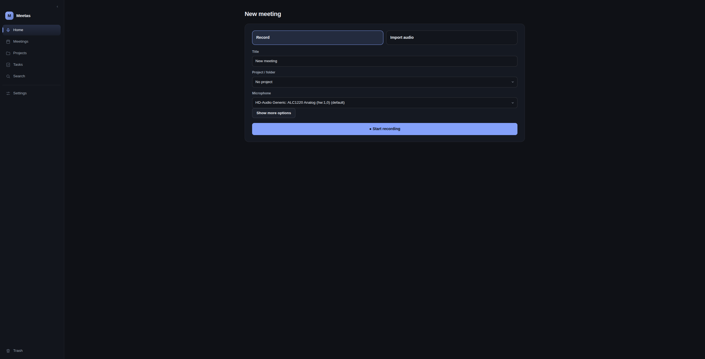

# meetas

**Your meetings stay on your machine.** 🎙️ `meetas` records meetings from your
microphone (or imports existing recordings), transcribes them **offline** with
local speech recognition, and answers questions, extracts tasks, and analyzes
everything with **your own local LLMs** — no cloud, no accounts, no external
AI services.

<p align="center">
  
</p>

---

## ✨ Features

**Capture**
- 🎙️ **Record meetings** — start, pause, resume, stop; everything stored crash-safely
- 📥 **Import existing recordings** — WAV, MP3, M4A, FLAC, OGG, OPUS, AAC (and
  video files) — resumable uploads, imported as normal meetings
- ⚡ **Live transcription** — rolling transcription while the meeting runs (opt-in)
- 🔊 **Audio enhancement** — optional local noise reduction with adjustable
  profiles; enhanced and original versions always available side by side

**Transcription**
- 📝 **Offline ASR** — local models from tiny to large-v3-turbo (faster-whisper)
  plus Parakeet for live; the language is auto-detected for **any language your
  selected model supports** — including code-switched meetings, per segment

**AI (all local)**
- 🤖 **Analyze meetings** — structured 9-section analysis (summary, topics,
  decisions, tasks, …) where every claim is anchored to the transcript —
  nothing is invented
- 💬 **Ask & chat** — grounded questions with real transcript citations (and an
  evidence level so you always see how solid the answer is), scoped to one
  meeting, a project, or several meetings; plus a general chat that never
  touches your meeting data
- ✨ **Auto title & tags** — let the local LLM suggest a title and tags for you
- 👥 **Speaker recognition** — local speaker diarization, speakers are
  renamable (opt-in)

**Organize & act**
- 📂 **Projects** — group meetings and documents (PDF, DOCX, ODT, XLSX, PPTX,
  TXT, MD, CSV); documents are indexed and become searchable & askable
- 🔎 **Search** — instant full-text + local hybrid (vector) search over
  transcripts and project documents
- ✅ **Tasks** — extract tasks from a meeting, central overview, history, archive
- 📊 **Cross-meeting insights** — compare meetings, multi-meeting digest
  (fully offline), recurring topics, and a timeline of your activity
- 🏷️ **Tags & markers** — organize meetings, mark important moments, edit
  transcripts with full version history
- 🗑️ **Trash** — soft delete with restore; permanent deletion only when you say so

**Output**
- 📤 **Export** — Markdown, TXT, JSON, HTML (PDF/DOCX with clean fallback),
  with selectable sections
- 💾 **Backups** — consistent local backup & restore with dry-run preview
- 🔒 **Data stays local** — no cloud, no telemetry, no network by default

---

## 🚀 Quick Start (Linux, ~3 minutes)

```bash
git clone https://github.com/highwinglabs/meetas
cd meetas
./install.sh
```

That's it. The web UI is **prebuilt** in the repository, so a normal install needs
**no Node/npm**. `install.sh` shows exactly what it will do and only adds what is
missing: the system packages `ffmpeg` + PortAudio, **Python 3.12 via `uv`**, and the
locked Python dependencies. It then initializes storage and starts the service.

Open **http://127.0.0.1:8765/** in your browser.

On first start the UI shows a short **setup assistant**: it downloads the speech
recognition model (one-time, with explicit confirmation) and sets up the local AI
model (Ollama-based) — or simply tells you the one command to run. The AI step is
skippable, and existing installations never see the assistant again.

| Flag | Effect |
|---|---|
| `--with-models` | Also download the live ASR model (network required) |
| `--with-ollama` | Also install Ollama (the AI-model runtime) and start it |
| `--no-start` | Install + initialize only; do not start the service |

By default **no models are downloaded** — you can fetch them on demand from the UI
at any time, and the full pipeline even runs without any AI server
(`MA_LLM_MOCK=true`).

> Developers working from source (Node/npm, test suite, `npm run dev`) should use
> the [Installation](#installation--configuration-for-developers) section instead.

---

## 🔒 Privacy

- **All data stays on your machine** — recordings, transcripts, documents, and
  analyses never leave your computer.
- **No cloud, no accounts, no telemetry.**
- **Network is disabled by default** (`network_allowed=false`). Any model download
  is a conscious, explicitly confirmed step.
- **Local AI instead of external AI services** — your meeting content is only ever
  sent to a model running on your own hardware (loopback).
- **The API listens on `127.0.0.1` only** — it is not reachable from the network.
- **No credentials** are required or stored by the app.

---

## ⚙️ How it works

```text
🎙️ Recording / 📥 Import
     ↓
📝 Transcription      offline ASR (local model), auto language detection
     ↓
🤖 Local AI           9-section analysis, titles & tags, tasks,
                      grounded Q&A — all anchored to the transcript
     ↓
📂 Organize           projects, documents, tags, markers, trash
     ↓
📤 Export / backup    Markdown, TXT, JSON, HTML · local backups
```

A typical workflow:

1. **Consent** — acknowledge the privacy notice once (required before the first
   recording).
2. **Record or import** — start a meeting (pause/resume as needed), or upload an
   existing audio file.
3. **Transcribe** — run offline ASR (model download is confirmation-gated if needed).
4. **Optional stages** — speaker diarization, audio enhancement, local embeddings,
   live transcription.
5. **Analyze** — trigger a structured local-LLM analysis and/or auto title & tags.
6. **Search, ask, chat** — search, ask grounded questions, or chat.
7. **Organize & act** — projects, tags, markers, tasks.
8. **Export / backup** — export the result and/or take a local backup.

---

## 🤖 Local AI

**Transcription (ASR)** runs fully offline with local models. The UI offers a
small, honest catalog: faster-whisper sizes from `tiny` (~75 MB) up to
`large-v3-turbo`, plus the Parakeet TDT 0.6B int8 adapter for live transcription.
Each entry shows size, runtime, and language coverage; you can benchmark ASR
models and choose per meeting.

**Analysis, questions, and chat** use an **already-running local LLM server** with
an OpenAI-compatible `/v1` interface. **Ollama is the recommended runtime** —
`./install.sh --with-ollama` installs and starts it, and the UI can pull Ollama
models with visible progress (always confirmation-gated). Any other
OpenAI-compatible server (e.g. llama.cpp) works as well. The app **never starts or
loads** an LLM itself — the server is an external process, reachable only over
loopback, and a real analysis runs only when you trigger one.

There are two deliberately separate chat modes:

- **Grounded Q&A (RAG)** — the answer must come from retrieved transcript segments
  and cite them (`[n]` markers, segment/timestamp). The response carries an
  evidence level (`grounded` / `partial` / `none`) so you always see how solid it
  is. If the transcript doesn't contain the answer, it says exactly that.
- **General chat** — plain chat with your local LLM that *deliberately* retrieves
  nothing, so it can never answer with your meeting data.

The analysis is strict JSON with nine sections (`kurzfassung`, `themen`,
`entscheidungen`, `aufgaben`, `offene_fragen`, `naechste_schritte`, `risiken`,
`wichtige_fakten`, `follow_ups`). Every entry carries at least one transcript
source (`segment_id` / `sprecher` / `timestamp`), and missing values are stored as
"not specified" — **never invented**. If the server is busy or absent, you get a
clear `503` after bounded retries.

**Model management in the UI:** see which ASR and LLM models are installed, test
your LLM connection, pull Ollama models — all without leaving the browser.

**Mock mode for development:** `MA_LLM_MOCK=true` (or `--mock` on the CLI) runs a
deterministic mock LLM with no server call at all.

The most relevant settings (full list in [`.env.example`](./.env.example)):

| Variable | Default | Meaning |
|---|---|---|
| `MA_LLM_BASE_URL` | `http://127.0.0.1:8081/v1` | Local OpenAI-compatible LLM server |
| `MA_OLLAMA_BASE_URL` | `http://127.0.0.1:11434/v1` | Ollama's OpenAI-compatible endpoint |
| `MA_LLM_MODEL` | `qwen3.8-27b-q4kxl` | Must match a model id your server reports under `/v1/models` |
| `MA_LLM_MOCK` | `false` | Use the deterministic mock LLM (no server call) |
| `MA_ASR_MODEL` | `small` | Final/batch ASR model |
| `MA_LIVE_ASR_MODEL` | `parakeet-tdt-0.6b-v3-int8` | Live ASR model (opt-in) |
| `MA_ASR_LANGUAGE` | auto | Force the transcription language (empty = auto-detect) |

`model_profiles` (in `config.json` or `MA_MODEL_PROFILES` JSON) can point each role
— `live` / `offline` / `sprecher` / `analyse` / `embeddings` / `reranking` — at a
different local model/endpoint.

---

## 🛡️ Technical safety

- **Crash-safe recording** — 1-second WAV chunks, each fsync'd; the chunk index is
  the source of truth, so a hard crash loses at most ~1 second and an interrupted
  session is completed automatically on restart.
- **Immutable original audio** — the assembled `original.wav` is written atomically
  and made read-only; re-transcription keeps previous versions instead of
  overwriting.
- **SQLite in WAL mode** — durable, concurrent-friendly local database
  (`0600`, so no other local user can read it; data dirs are `0700`).
- **Local-only API** — bound to `127.0.0.1`; no telemetry, no cloud module, no
  network by default; uploads are size-capped.
- **Separate UI & core** — the React UI is a pure client of the REST API, served
  statically by the core; REST routes can never be shadowed by the UI (no
  catch-all route).
- **Independent daemon** — double-fork + `setsid`; the core survives a UI crash.
  A lock + PID file enforces a single instance.
- **Consent-gated** — recording starts only after a one-time, persisted privacy
  notice.
- **Safe deletion** — meetings and documents move to the trash first; restoring is
  one click, permanent deletion is explicit.

---

## ⚙️ Installation & Configuration (for developers)

### Requirements

| Component | Role | Notes |
|---|---|---|
| **Python 3.12** | Runtime | `uv` uses/provisions it automatically |
| **uv** | venv + dependencies + lockfile | https://docs.astral.sh/uv/ |
| **ffmpeg** | Assemble chunks / import & enhance audio | External system binary |
| **PortAudio** (`libportaudio2`) | Microphone capture via `sounddevice` | External system library |
| **A local LLM server** (optional) | OpenAI-compatible `/v1` endpoint (e.g. llama.cpp, Ollama) | External, already running; the app never starts one |
| **Node.js + npm** | One-time build of the React UI (`ui/`) | Build-time only |

`ffmpeg`, PortAudio, a local LLM server, and Node are **external system components**
— they are not installed into the virtual environment. Node is needed only to build
the UI once; at runtime the core alone is sufficient.

System packages (one-time, outside the venv):

| Package | Debian / Ubuntu | Fedora | macOS (Homebrew) |
|---|---|---|---|
| **ffmpeg** | `sudo apt install ffmpeg` | `sudo dnf install ffmpeg` | `brew install ffmpeg` |
| **PortAudio** | `sudo apt install libportaudio2` | `sudo dnf install portaudio` | `brew install portaudio` |
| **uv** | `curl -LsSf https://astral.sh/uv/install.sh \| sh` | `sudo dnf install uv` | `brew install uv` |
| **Node.js** (UI build only) | `sudo apt install nodejs npm` | `sudo dnf install nodejs npm` | `brew install node` |

### Python setup

All Python dependencies live **only** in `.venv/`; nothing is installed or removed
globally. The reproducible dependency list is in
[`uv.lock`](./uv.lock), declared in [`pyproject.toml`](./pyproject.toml).

```bash
uv venv .venv --python 3.12
uv sync                 # base dependencies
uv sync --extra diar    # + CPU-only PyTorch (optional diarization / VAD)
uv sync --extra dev     # + pytest, httpx (tests)
```

### Configuration

Precedence (**highest wins**):

1. Real environment variables (shell / systemd `EnvironmentFile`).
2. A `.env` file (project directory or `MA_BASE_DIR`) — see `.env.example`.
3. `config.json` in `MA_BASE_DIR` (generated/edited at runtime).
4. Built-in defaults.

```bash
cp .env.example .env   # then edit the values you need
```

No credentials are required. All settings:

| Variable | Default | Meaning |
|---|---|---|
| `MA_BASE_DIR` | `~/.local/share/meeting_assistant` | Where all data/audio/logs/state live |
| `MA_HOST` | `127.0.0.1` | API host (loopback; do not expose publicly) |
| `MA_PORT` | `8765` | API port |
| `MA_NETWORK_ALLOWED` | `false` | Allow network access (model downloads) |
| `MA_SAMPLE_RATE` / `MA_CHANNELS` | `16000` / `1` | Capture defaults |
| `MA_ASR_MODEL` | `small` | Final/batch ASR model |
| `MA_LIVE_ASR_MODEL` | `parakeet-tdt-0.6b-v3-int8` | Live ASR model (opt-in) |
| `MA_ASR_LANGUAGE` | auto | Force the transcription language (empty = auto-detect) |
| `MA_LIVE_TRANSCRIPTION` | `false` | Rolling-window live transcription |
| `MA_SPEAKER_DIARIZATION` | `false` | Local speaker diarization |
| `MA_MIC_ENHANCEMENT` | `false` | Optional local audio enhancement (noise reduction) |
| `MA_LLM_BASE_URL` | `http://127.0.0.1:8081/v1` | Local OpenAI-compatible LLM server |
| `MA_OLLAMA_BASE_URL` | `http://127.0.0.1:11434/v1` | Ollama OpenAI-compatible endpoint |
| `MA_LLM_MODEL` | `qwen3.8-27b-q4kxl` | Must match a model id your server reports under `/v1/models` |
| `MA_LLM_MOCK` | `false` | Use the deterministic mock LLM (no server call) |
| `MA_EMBEDDINGS` / `MA_RAG` | `true` / `true` | Local relevance index / grounded RAG |
| `MA_AUTO_PIPELINE` / `MA_AUTO_ANALYZE` | `false` / `false` | Auto-processing after stop |

**Choosing a microphone:** set `input_device_name` to a case-insensitive substring
of your device name (e.g. `"headset"`), or `input_device_index` to an explicit
PortAudio index. Leave both unset to use the system default device.

### Running

The core is an **independent OS process** (double-fork + `setsid`) that survives a
UI crash and binds to `127.0.0.1` only.

```bash
meeting-core init          # create storage + run Alembic migrations + recovery
meeting-core devices       # list input devices
meeting-core serve         # run in the foreground
meeting-core daemon        # run as an independent daemon
meeting-core status        # show status
meeting-core stop          # stop the daemon
meeting-core restart       # restart the daemon
meeting-core recovery      # run crash recovery manually
meeting-core models        # ASR model status
meeting-core download-model --confirm   # download an ASR model
meeting-core llm           # show LLM status (no request)
```

Per-meeting CLI examples:

```bash
meeting-core transcribe <id>            # offline transcription
meeting-core diarize <id>               # local speaker diarization
meeting-core analyze <id> --mock        # analysis (mock LLM for development)
meeting-core search "budget"            # full-text search
meeting-core export <id> --format markdown
```

**Start automatically (systemd `--user`):** a ready unit ships in
`packaging/systemd/meeting-assistant.service` — it starts the core under systemd
(still loopback-only) and restarts it on failure:

```bash
mkdir -p ~/.config/systemd/user
cp packaging/systemd/meeting-assistant.service ~/.config/systemd/user/
systemctl --user daemon-reload
systemctl --user enable --now meeting-assistant.service
```

**Migrations on existing data:** `init`/`serve`/`daemon` always run Alembic. An
existing database is **never deleted or overwritten**; only missing migrations up
to `head` are applied (a legacy DB with base tables but an empty `alembic_version`
is stamped, not re-migrated).

### Storage layout

```
~/.local/share/meeting_assistant/
├── config.json
├── data/meeting_assistant.db        # SQLite (WAL), mode 0600
├── audio/<meeting_id>/
│   ├── chunks/chunk_NNNNNN.wav      # 1-second chunks
│   ├── chunks.index.jsonl           # authoritative index (fsync per line)
│   ├── events.jsonl                 # pause/resume/stop events
│   ├── meta.json
│   ├── original.wav                 # assembled atomically, read-only (0444)
│   ├── enhanced.wav                 # optional enhanced copy (noise reduction)
│   └── in_progress                  # marker while recording
├── exports/
├── logs/core.log
└── state/{core.lock, core.pid}
```

Data, state, audio, logs, and export directories use `0700`, the database `0600`.
The microphone is captured at the device's **native** sample rate; `original.wav`
stays high-fidelity, and `original_16k.wav` is the auto-generated copy used for ASR.

### Web UI (building from source)

The UI is a **React + TypeScript + Vite** single-page app under `ui/`. It is a pure
client of the REST API and is served statically by the core (no separate process,
no cross-origin, no cloud). Without a built `ui/dist/`, the core is a **pure REST
API** — all endpoints still work.

```bash
cd ui
npm install        # once
npm run build      # production build to ui/dist (served by the core)
npm run dev        # optional: dev server with live reload (:5173, API proxied to core)
```

Build path: `<project>/ui/dist` (override with `MA_UI_DIST`). The UI stores nothing
itself; all state lives in the core (SQLite + filesystem).

### REST API

The full API is local-only (`127.0.0.1`) — the endpoint list lives in
`core/api/rest.py`, request/response shapes in `core/api/schemas.py`. Quick taste:

```bash
curl -s localhost:8765/health
curl -s -X POST localhost:8765/consent/ack -d '{"acknowledged": true}'
curl -s -X POST localhost:8765/meetings -d '{"title":"Standup"}'
```

Key endpoints: `POST /meetings` (start), `POST /meetings/{id}/pause|resume|stop`,
`POST /meetings/{id}/transcribe`, `POST /meetings/{id}/analyze`,
`POST /meetings/{id}/diarize`, `GET /search?q=`, `GET /ask?q=` / `POST /chat`
(grounded RAG), `POST /chat/general` (LLM chat without meeting data),
`GET /projects` + `POST /uploads` (projects & imports),
`GET /meetings/compare` · `/multi-summary` · `/recurring-topics` · `/timeline`
(cross-meeting insights), `GET /tasks`, `POST /meetings/{id}/export`,
`POST /backup` · `GET /backup` · `POST /backup/restore`, `GET /trash`,
`POST /models/asr/download` (confirmed, local).

### Language (de/en)

Three **independent** language axes:

1. **Interface language** — German (default) or English, switchable in the UI
   (persisted in the browser). The UI also sends it as `Accept-Language`, so the
   core localises its **error messages** and **consent notice** to match.
2. **Transcription language** — auto-detected per meeting for whatever languages
   the selected ASR model covers, or forced globally via `MA_ASR_LANGUAGE` or per
   meeting in the UI.
3. **Analysis language** — chosen per meeting, independent of the other two.

Switching the interface language never changes what is transcribed or analysed.
Exports are written in the meeting's analysis/transcription language, not the
interface language.

### If you want to expose the API beyond loopback

Not recommended, and the app intentionally ships **no authentication** because it is
designed to be reachable only on the local machine. You would need to add your own
authentication and a reverse proxy with TLS.

---

## 🧪 Development & Testing

The test suite is **headless and offline**: capture uses synthetic/file sources
(never a real microphone), and ASR and LLM run on mocks or `httpx.MockTransport`
(never a real model or LLM call).

```bash
uv sync --extra dev     # once
uv run pytest -q
```

Coverage includes: chunk storage, pause/resume, crash recovery, DB persistence
(WAL, FK cascade, permissions), devices, daemon lock, REST API, ASR transcription,
FTS search, export, LLM analysis including busy/error paths, static UI serving
without shadowing REST routes, live transcription, local diarization, the
rolling-window pipeline, and backup/restore.

For UI changes, run the TypeScript build:

```bash
cd ui && npm run build
```

---

## 📄 License

Distributed under the **MIT License** — see [LICENSE](./LICENSE).
